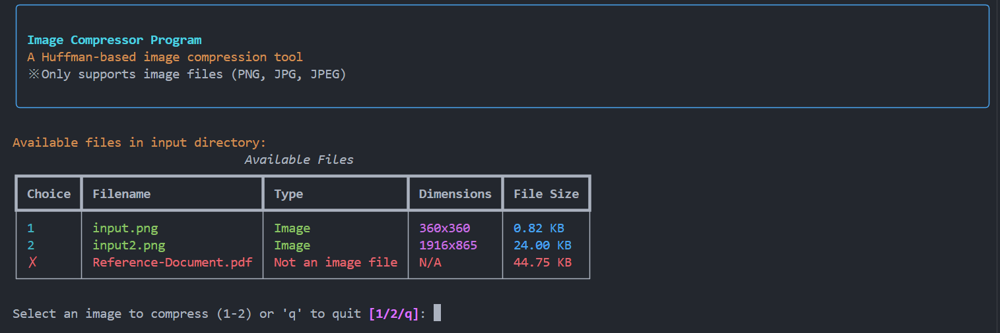

<h1 align="center">Huffman Image Compressor</h1>



## Table of Contents
- [Description](#description)
- [Tech Stack](#tech-stack)
- [Structure](#structure)
- [How It Works](#how-it-works)
- [Getting Started](#getting-started)

## Description
Huffman Image Compressor is a Command-Line Interface (CLI) tool designed for compressing grayscale images using the Huffman coding algorithm. This tool provides a simple and efficient way to reduce the size of grayscale images while ensuring no loss of quality. With an intuitive CLI interface, users can interact with the program to compress or decompress images and view key metrics about the process.

## Tech Stack
- Python 3.8+
- Libraries:
    - numpy
    - Pillow
    - Rich

## Structure
```
├── test/
|   ├── input
|   └── output
├── image_compressor.py
├── main.py
├── requirements.txt
└── README.md
```

## How It Works
The program operates through simple CLI interactions:
1. **Input Images**

    Place the grayscale images you want to compress in the `test/input` folder.
2. **Compression Process:**
    - This program reads the grayscale image and calculates pixel frequency.
    - A Huffman tree is built, and pixel values are encoded into binary format.
    - Compressed binary data (.bin) and Huffman codes (.json) are saved in the `test/output` folder.
3. **Decompression:**
    
    If the user chooses to decompress, the program reconstructs the original grayscale image from the .bin file using the Huffman codes stored in the .json file. The decompressed image is saved in the `test/output` folder.
4. **Metrics Display:**
    
    A table summarizes the input file properties, compression results, and decompressed image details.


## Getting Started
1. **Clone this repository:**
   ```bash
   git clone https://github.com/carllix/Huffman-Image-Compressor.git
   ```
2. **Navigate to the src directory of the program by running the following command in the terminal:**
   ```bash
   cd Huffman-Image-Compressor
   ```
3. **Create a virtual environment using the following command:**
    ```bash
   python -m venv venv
   ```
4. **Activate the environment**

    **For Windows:**
    ```bash
    venv\Scripts\activate
    ```
   **For MacOS/Linux:**
    ```bash
    source venv/bin/activate
    ```
5. **Install the required dependencies for the program by running:**
   ```bash
   pip install -r requirements.txt
   ```
6. **Run program using the following command:**
    ```bash
   python main.py
   ```
